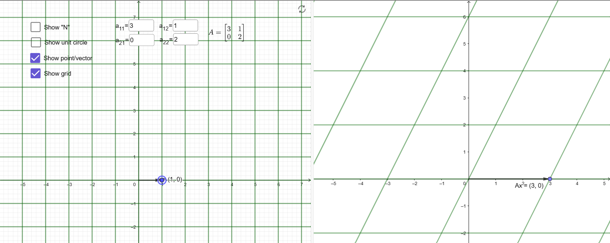
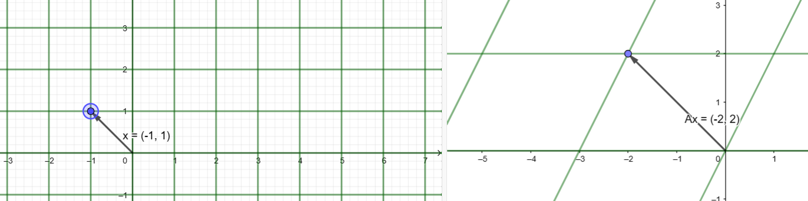

# Inside the Matrix: The Art and Science of Mathematical Marvels

## What is Matrix?

Matrices, the plural form of a matrix, are the arrangements of numbers, variables, symbols, or expressions in a rectangular table that contains various numbers of rows and columns. They are rectangular-shaped arrays, for which different operations like addition, multiplication, and transposition are defined. The numbers or entries in the matrix are known as its elements. Horizontal entries of matrices are called rows and vertical entries are known as columns.

## Different types of Matrices

Before going to the mathematical operations with matrices, let's first see some types of it.

### Lower & Upper Triangular Matrix

A lower triangular matrix is a square matrix whose all elements above the principal diagonal are zeros. A upper triangular matrix is a square matrix whose all elements below the principal diagonal are zeros. For example, the matrix

$$ \begin{bmatrix}
2 & -1 & 3\\
0 & 5 & 2\\
0 & 0 & -2
\end{bmatrix} $$

is an upper triangular matrix, and the matrix

$$ \begin{bmatrix}
2 & 0 & 0\\
1 & 5 & 0\\
1 & -1 & -2
\end{bmatrix} $$

is a lower triangular matrix.

### Diagonal Matrix

A diagonal matrix is a matrix that is both upper triangular and lower triangular. i.e., all the elements above and below the principal diagonal are zeros and hence the name "diagonal matrix". Its mathematical definition is, a matrix A = [$a_{ij}$] is said to be diagonal if

- A is a square matrix
- $a_{ij} = 0$ when $i \neq j$

$$ \begin{bmatrix}
4 & 0 & 0 & 0\\
0 & -2 & 0 & 0\\
0 & 0 & 1 & 0\\
0 & 0 & 0 & 7
\end{bmatrix} $$

Note to remember is that the diagonal elements of a diagonal matrix can be either zeros or non-zeros.

- **Power:** The nth power of a diagonal matrix (where n is a non-negative integer) can be obtained by raising each diagonal element to the power of n.
- **Eigen values:** The eigen values of a diagonal matrix are just the values on the diagonal. The corresponding eigen vectors are the standard basis vectors.\
- **Multiplication by a Vector:** When a diagonal matrix multiplies a vector, it scales each component of the vector by the corresponding element on the diagonal.
- **Matrix Multiplication:** The product of two diagonal matrices is just the diagonal matrix with the corresponding elements on the diagonals multiplied.

You can read more about the diagonal matrix [here](https://www.cuemath.com/algebra/diagonal-matrix).

### Orthogonal Matrix

Let's say you have a matrix $A$. You have calculated it's inverse ($A^{-1}$) and transpose ($A^T$) and if the formula $A^T = A^{-1}$ satisfies, then the matrix $A$ is called Orthogonal Matrix. So, you can rearrange the formula like this

$A^T = A^{-1}$

$=> AA^T = AA^{-1} \ (Multiply \ A \  to \ the \ both \ sides)$

$=> AA^T = I \ (Where \ AA^{-1} \ is \ an \ identical \ matrix)$

$=> A^TA = I \ (In \ a \ similar \ way)$

$=> AA^T = A^TA = I$

- An orthogonal matrix is a square matrix whose columns and rows are orthogonal unit vectors (i.e., orthogonal vectors), meaning that they are all of unit length and are at right angles to each other.
- **Inverse Equals Transpose:** The transpose of an orthogonal matrix equals its inverse, e.e., $A^T = A^{-1}$. This property makes calculations with orthogonal matrices computationally efficient.

To know more, click [here](https://www.cuemath.com/algebra/orthogonal-matrix/) and for [Identical Matrix](https://www.cuemath.com/algebra/identity-matrix).

### Symmetric Matrix

A symmetric matrix is those matrix which satisfy the formula

$$ A = A^T $$

where $A$ is a $(n \times n)$ matrix.

- **Real Eigen Values:** The eigen values of a real symmetric matrix are always real, not complex.
- **Orthogonal Eigen Vectors:** For a real symmetric matrix, the eigen vectors corresponding to different eigen values are always orthogonal to each other. If the eigen values are distinct, you can even choose an orthonormal basis of eigen vectors.

## Determinate

The determinant of a matrix is a scalar value that is a function of the entries of a square matrix. It characterizes some properties of the matrix and the linear map represented by the matrix. In particular, the determinant is nonzero if and only if the matrix is invertible and the linear map represented by the matrix is an isomorphism.

The determinant of a matrix $A$ is represented by two vertical lines or simply by writing det and writing the matrix name. For example, $|A|$, $det(A)$, $det \ A$, or $Δ$.

**Calculate a 2X2 matrix determinate**

If we have a matrix

$A = \begin{bmatrix}
a & b\\
c & d\\
\end{bmatrix} \ then \ |A| = (a \times d) - (b \times c)$

**Calculate a 3X3 matrix determinate**

$A = \begin{bmatrix}
a_1 & b_1 & c_1\\
a_2 & b_2 & c_2\\
a_3 & b_3 & c_3\\
\end{bmatrix} \ then \ |A| = 
a_1.\begin{vmatrix}
b_2 & c_2\\
b_3 & c_3
\end{vmatrix} - 
b_1.\begin{vmatrix}
a_2 & c_2\\
a_3 & c_3
\end{vmatrix} + 
c_1.\begin{vmatrix}
a_2 & b_2\\
a_3 & b_3
\end{vmatrix}$

**Calculate a 4X4 matrix determinate**

$A = \begin{bmatrix}
a_1 & b_1 & c_2 & d_1\\
a_2 & b_2 & c_2 & d_2\\
a_3 & b_3 & c_3 & d_3\\
a_4 & b_4 & c_4 & d_4
\end{bmatrix}$

$|A| = 
a_1.\begin{vmatrix}
b_2 & c_2 & d_2\\
b_3 & c_3 & d_3\\
b_4 & c_4 & d_4
\end{vmatrix} - 
b_1.\begin{vmatrix}
a_2 & c_2 & d_2\\
a_3 & c_3 & d_3\\
a_4 & c_4 & d_4
\end{vmatrix} +
c_1.\begin{vmatrix}
a_2 & b_2 & d_2\\
a_3 & b_3 & d_3\\
a_4 & b_4 & d_4
\end{vmatrix} -
d_1.\begin{vmatrix}
a_2 & b_2 & c_2\\
a_3 & b_3 & c_3\\
a_4 & b_4 & c_4
\end{vmatrix}$

**See the sign of the every even term while calculating the determinate. That'a an important term to remember.**

### Properties
- The determinate of any 1X1 matrix is always equal to the element of the matrix.
- The determinate of a matrix is equal to the determinate of its transpose.
- If any two rows (or columns) of a determinant are interchanged, then the sign of the determinant changes.
- If any two rows (or columns) of a determinant are identical, then the determinant is 0.
- If all elements of a row (or column) of a matrix of a determinant are zeros, then the value of the determinant is 0.
- If each element of a row (or column) of a determinant is multiplied by a scalar k, then the value of the resultant determinant is k times the value of the original determinant.
- If each element of a row (or column) of a determinant is expressed as sum of two (or more) numbers, then the determinant can be split into the sum of two (or more) determinants.
- If each element of a row (or column) is multiplied by a constant and the elements are added to the corresponding elements of another row (or column), then the determinant remains unchanged.
- The determinant of an identity matrix is always 1.
- The determinant of a diagonal matrix is always the product of elements of its principal diagonal.
- The determinant of an orthogonal matrix is either +1 or -1.

## Inverse Matrix

The inverse of a matrix is a matrix that, when multiplied by the original matrix, gives the [identity matrix](https://www.cuemath.com/algebra/identity-matrix). The inverse of a matrix $A$ is denoted by $A^{-1}$, and it satisfies the property

<math xmlns="http://www.w3.org/1998/Math/MathML" display="block"><semantics><mrow><mi>A</mi><msup><mi>A</mi><mrow><mo>−</mo><mn>1</mn></mrow></msup><mo>=</mo><msup><mi>A</mi><mrow><mo>−</mo><mn>1</mn></mrow></msup><mi>A</mi><mo>=</mo><mi>I</mi></mrow><annotation encoding="application/x-tex">AA^{-1} = A^{-1}A = I
</annotation></semantics></math>

Not every matrix has an inverse. Only **square matrices** can have an inverse, and only if their **determinant** is not zero. The determinant is a scalar value that can be calculated from a square matrix and has some properties related to the linear transformation represented by the matrix. A matrix that has an inverse is called **invertible** or **nonsingular**, and a matrix that does not have an inverse is called **noninvertible** or **singular**.

### How to find the inverse of a matrix?

There are different methods to find the inverse of a matrix, depending on the size and complexity of the matrix. Some of the common methods are:

- For a 2 x 2 matrix, the inverse can be found using a simple formula:

<math xmlns="http://www.w3.org/1998/Math/MathML" display="block"><semantics><mrow><msup><mrow><mo fence="true">[</mo><mtable rowspacing="0.16em" columnalign="center center" columnspacing="1em"><mtr><mtd><mstyle scriptlevel="0" displaystyle="false"><mi>a</mi></mstyle></mtd><mtd><mstyle scriptlevel="0" displaystyle="false"><mi>b</mi></mstyle></mtd></mtr><mtr><mtd><mstyle scriptlevel="0" displaystyle="false"><mi>c</mi></mstyle></mtd><mtd><mstyle scriptlevel="0" displaystyle="false"><mi>d</mi></mstyle></mtd></mtr></mtable><mo fence="true">]</mo></mrow><mrow><mo>−</mo><mn>1</mn></mrow></msup><mo>=</mo><mfrac><mn>1</mn><mrow><mi>a</mi><mi>d</mi><mo>−</mo><mi>b</mi><mi>c</mi></mrow></mfrac><mrow><mo fence="true">[</mo><mtable rowspacing="0.16em" columnalign="center center" columnspacing="1em"><mtr><mtd><mstyle scriptlevel="0" displaystyle="false"><mi>d</mi></mstyle></mtd><mtd><mstyle scriptlevel="0" displaystyle="false"><mrow><mo>−</mo><mi>b</mi></mrow></mstyle></mtd></mtr><mtr><mtd><mstyle scriptlevel="0" displaystyle="false"><mrow><mo>−</mo><mi>c</mi></mrow></mstyle></mtd><mtd><mstyle scriptlevel="0" displaystyle="false"><mi>a</mi></mstyle></mtd></mtr></mtable><mo fence="true">]</mo></mrow></mrow><annotation encoding="application/x-tex">\begin{bmatrix}
a &amp; b \\
c &amp; d
\end{bmatrix}^{-1}
=
\frac{1}{ad-bc}
\begin{bmatrix}
d &amp; -b \\
-c &amp; a
\end{bmatrix}
</annotation></semantics></math>

where $ad-bc$ is the determinant of the matrix.

- For a larger matrix (n x n), the inverse can be found using the adjoint method. This method involves finding the minors and cofactors of the elements of the matrix, and then using them to form the adjugate or adjoint matrix. The adjugate matrix is the transpose of the cofactor matrix. The cofactor matrix is obtained by multiplying each minor by (-1)^(i+j), where i and j are the row and column indices of the element. The minor of an element is the determinant of the submatrix obtained by deleting its row and column. The formula for the inverse using this method is:

<math xmlns="http://www.w3.org/1998/Math/MathML" display="block"><semantics><mrow><msup><mi>A</mi><mrow><mo>−</mo><mn>1</mn></mrow></msup><mo>=</mo><mfrac><mn>1</mn><mrow><mi mathvariant="normal">∣</mi><mi>A</mi><mi mathvariant="normal">∣</mi></mrow></mfrac><mtext>adj</mtext><mo stretchy="false">(</mo><mi>A</mi><mo stretchy="false">)</mo></mrow><annotation encoding="application/x-tex">A^{-1} = \frac{1}{|A|}\text{adj}(A)
</annotation></semantics></math>

where $|A|$ is the determinant of $A$ and $adj(A)$ is the adjugate of A. For example, if

$$ A = \begin{bmatrix}
1 & 2 & 3\\
0 & -4 & 1\\
2 & 0 & -3
\end{bmatrix} \ then \ |A| = 48 $$

The minors of A are:

$$M_{11} = \begin{bmatrix}
-4 & 1\\
0 & -3
\end{bmatrix} = 12$$

$$M_{12} = \begin{bmatrix}
0 & 1\\
2 & -3
\end{bmatrix} = -2$$

$$M_{13} = \begin{bmatrix}
0 & -4\\
2 & 0
\end{bmatrix} = 8$$

$$M_{21} = \begin{bmatrix}
2 & 3\\
0 & -3
\end{bmatrix} = -6$$

$$M_{22} = \begin{bmatrix}
1 & 3\\
2 & -3
\end{bmatrix} = -9$$

$$M_{23} = \begin{bmatrix}
1 & 2\\
2 & 0
\end{bmatrix} = -4$$

$$M_{31} ​= \begin{bmatrix}
​2 & 3\\
​-4 & 1
\end{bmatrix} = 14$$

$$M_{32} ​= \begin{bmatrix}
​1 & 3\\
​0 & 1
\end{bmatrix} ​​= 1$$

$$M_{33}​ = \begin{bmatrix}
​1 & 2\\
​0 & −4
\end{bmatrix} ​​= −4$$

The cofactors of A are:

<math xmlns="http://www.w3.org/1998/Math/MathML" display="block"><semantics><mrow><msub><mi>C</mi><mn>11</mn></msub><mo>=</mo><mo stretchy="false">(</mo><mo>−</mo><mn>1</mn><msup><mo stretchy="false">)</mo><mrow><mn>1</mn><mo>+</mo><mn>1</mn></mrow></msup><msub><mi>M</mi><mn>11</mn></msub><mo>=</mo><mn>12</mn></mrow><annotation encoding="application/x-tex">C_{11} = (-1)^{1+1}M_{11} = 12
</annotation></semantics></math>

<math xmlns="http://www.w3.org/1998/Math/MathML" display="block"><semantics><mrow><msub><mi>C</mi><mn>12</mn></msub><mo>=</mo><mo stretchy="false">(</mo><mo>−</mo><mn>1</mn><msup><mo stretchy="false">)</mo><mrow><mn>1</mn><mo>+</mo><mn>2</mn></mrow></msup><msub><mi>M</mi><mn>12</mn></msub><mo>=</mo><mn>2</mn></mrow><annotation encoding="application/x-tex">C_{12} = (-1)^{1+2}M_{12} = 2
</annotation></semantics></math>

<math xmlns="http://www.w3.org/1998/Math/MathML" display="block"><semantics><mrow><msub><mi>C</mi><mn>13</mn></msub><mo>=</mo><mo stretchy="false">(</mo><mo>−</mo><mn>1</mn><msup><mo stretchy="false">)</mo><mrow><mn>1</mn><mo>+</mo><mn>3</mn></mrow></msup><msub><mi>M</mi><mn>13</mn></msub><mo>=</mo><mn>8</mn></mrow><annotation encoding="application/x-tex">C_{13} = (-1)^{1+3}M_{13} = 8
</annotation></semantics></math>

<math xmlns="http://www.w3.org/1998/Math/MathML" display="block"><semantics><mrow><msub><mi>C</mi><mn>21</mn></msub><mo>=</mo><mo stretchy="false">(</mo><mo>−</mo><mn>1</mn><msup><mo stretchy="false">)</mo><mrow><mn>2</mn><mo>+</mo><mn>1</mn></mrow></msup><msub><mi>M</mi><mn>21</mn></msub><mo>=</mo><mn>6</mn></mrow><annotation encoding="application/x-tex">C_{21} = (-1)^{2+1}M_{21} = 6
</annotation></semantics></math>

<math xmlns="http://www.w3.org/1998/Math/MathML" display="block"><semantics><mrow><msub><mi>C</mi><mn>22</mn></msub><mo>=</mo><mo stretchy="false">(</mo><mo>−</mo><mn>1</mn><msup><mo stretchy="false">)</mo><mrow><mn>2</mn><mo>+</mo><mn>2</mn></mrow></msup><msub><mi>M</mi><mn>22</mn></msub><mo>=</mo><mo>−</mo><mn>9</mn></mrow><annotation encoding="application/x-tex">C_{22} = (-1)^{2+2}M_{22} = -9
</annotation></semantics></math>

<math xmlns="http://www.w3.org/1998/Math/MathML" display="block"><semantics><mrow><msub><mi>C</mi><mn>23</mn></msub><mo>=</mo><mo stretchy="false">(</mo><mo>−</mo><mn>1</mn><msup><mo stretchy="false">)</mo><mrow><mn>2</mn><mo>+</mo><mn>3</mn></mrow></msup><msub><mi>M</mi><mn>23</mn></msub><mo>=</mo><mn>4</mn></mrow><annotation encoding="application/x-tex">C_{23} = (-1)^{2+3}M_{23} = 4
</annotation></semantics></math>

<math xmlns="http://www.w3.org/1998/Math/MathML" display="block"><semantics><mrow><msub><mi>C</mi><mn>31</mn></msub><mo>=</mo><mo stretchy="false">(</mo><mo>−</mo><mn>1</mn><msup><mo stretchy="false">)</mo><mrow><mn>3</mn><mo>+</mo><mn>1</mn></mrow></msup><msub><mi>M</mi><mn>31</mn></msub><mo>=</mo><mn>14</mn></mrow><annotation encoding="application/x-tex">C_{31} = (-1)^{3+1}M_{31} = 14
</annotation></semantics></math>

<math xmlns="http://www.w3.org/1998/Math/MathML" display="block"><semantics><mrow><msub><mi>C</mi><mn>32</mn></msub><mo>=</mo><mo stretchy="false">(</mo><mo>−</mo><mn>1</mn><msup><mo stretchy="false">)</mo><mrow><mn>3</mn><mo>+</mo><mn>2</mn></mrow></msup><msub><mi>M</mi><mn>32</mn></msub><mo>=</mo><mo>−</mo><mn>1</mn></mrow><annotation encoding="application/x-tex">C_{32} = (-1)^{3+2}M_{32} = -1
</annotation></semantics></math>

<math xmlns="http://www.w3.org/1998/Math/MathML" display="block"><semantics><mrow><msub><mi>C</mi><mn>33</mn></msub><mo>=</mo><mo stretchy="false">(</mo><mo>−</mo><mn>1</mn><msup><mo stretchy="false">)</mo><mrow><mn>3</mn><mo>+</mo><mn>3</mn></mrow></msup><msub><mi>M</mi><mn>33</mn></msub><mo>=</mo><mo>−</mo><mn>4</mn></mrow><annotation encoding="application/x-tex">C_{33} = (-1)^{3+3}M_{33} = -4
</annotation></semantics></math>

The adjugate of A is:

<math xmlns="http://www.w3.org/1998/Math/MathML" display="block"><semantics><mrow><mtext>adj</mtext><mo stretchy="false">(</mo><mi>A</mi><mo stretchy="false">)</mo><mo>=</mo><mrow><mo fence="true">[</mo><mtable rowspacing="0.16em" columnalign="center center center" columnspacing="1em"><mtr><mtd><mstyle scriptlevel="0" displaystyle="false"><msub><mi>C</mi><mn>11</mn></msub></mstyle></mtd><mtd><mstyle scriptlevel="0" displaystyle="false"><msub><mi>C</mi><mn>21</mn></msub></mstyle></mtd><mtd><mstyle scriptlevel="0" displaystyle="false"><msub><mi>C</mi><mn>31</mn></msub></mstyle></mtd></mtr><mtr><mtd><mstyle scriptlevel="0" displaystyle="false"><msub><mi>C</mi><mn>12</mn></msub></mstyle></mtd><mtd><mstyle scriptlevel="0" displaystyle="false"><msub><mi>C</mi><mn>22</mn></msub></mstyle></mtd><mtd><mstyle scriptlevel="0" displaystyle="false"><msub><mi>C</mi><mn>32</mn></msub></mstyle></mtd></mtr><mtr><mtd><mstyle scriptlevel="0" displaystyle="false"><msub><mi>C</mi><mn>13</mn></msub></mstyle></mtd><mtd><mstyle scriptlevel="0" displaystyle="false"><msub><mi>C</mi><mn>23</mn></msub></mstyle></mtd><mtd><mstyle scriptlevel="0" displaystyle="false"><msub><mi>C</mi><mn>33</mn></msub></mstyle></mtd></mtr></mtable><mo fence="true">]</mo></mrow><mo>=</mo><mrow><mo fence="true">[</mo><mtable rowspacing="0.16em" columnalign="center center center" columnspacing="1em"><mtr><mtd><mstyle scriptlevel="0" displaystyle="false"><mn>12</mn></mstyle></mtd><mtd><mstyle scriptlevel="0" displaystyle="false"><mn>6</mn></mstyle></mtd><mtd><mstyle scriptlevel="0" displaystyle="false"><mn>14</mn></mstyle></mtd></mtr><mtr><mtd><mstyle scriptlevel="0" displaystyle="false"><mn>2</mn></mstyle></mtd><mtd><mstyle scriptlevel="0" displaystyle="false"><mrow><mo>−</mo><mn>9</mn></mrow></mstyle></mtd><mtd><mstyle scriptlevel="0" displaystyle="false"><mrow><mo>−</mo><mn>1</mn></mrow></mstyle></mtd></mtr><mtr><mtd><mstyle scriptlevel="0" displaystyle="false"><mn>8</mn></mstyle></mtd><mtd><mstyle scriptlevel="0" displaystyle="false"><mn>4</mn></mstyle></mtd><mtd><mstyle scriptlevel="0" displaystyle="false"><mrow><mo>−</mo><mn>4</mn></mrow></mstyle></mtd></mtr></mtable><mo fence="true">]</mo></mrow></mrow><annotation encoding="application/x-tex">\text{adj}(A) =
\begin{bmatrix}
C_{11} &amp; C_{21} &amp; C_{31}\\
C_{12} &amp; C_{22} &amp; C_{32}\\
C_{13} &amp; C_{23} &amp; C_{33}\\
\end{bmatrix}
=
\begin{bmatrix}
12 &amp; 6 &amp; 14\\
2 &amp; -9 &amp; -1\\
8 &amp; 4 &amp; -4\\
\end{bmatrix}
</annotation></semantics></math>

The inverse of A is:

<math xmlns="http://www.w3.org/1998/Math/MathML" display="block"><semantics><mrow><msup><mi>A</mi><mrow><mo>−</mo><mn>1</mn></mrow></msup><mo>=</mo><mfrac><mn>1</mn><mrow><mi mathvariant="normal">∣</mi><mi>A</mi><mi mathvariant="normal">∣</mi></mrow></mfrac><mtext>adj</mtext><mo stretchy="false">(</mo><mi>A</mi><mo stretchy="false">)</mo><mo>=</mo><mfrac><mn>1</mn><mn>48</mn></mfrac><mrow><mo fence="true">[</mo><mtable rowspacing="0.16em" columnalign="center center center" columnspacing="1em"><mtr><mtd><mstyle scriptlevel="0" displaystyle="false"><mn>12</mn></mstyle></mtd><mtd><mstyle scriptlevel="0" displaystyle="false"><mn>6</mn></mstyle></mtd><mtd><mstyle scriptlevel="0" displaystyle="false"><mn>14</mn></mstyle></mtd></mtr><mtr><mtd><mstyle scriptlevel="0" displaystyle="false"><mn>2</mn></mstyle></mtd><mtd><mstyle scriptlevel="0" displaystyle="false"><mrow><mo>−</mo><mn>9</mn></mrow></mstyle></mtd><mtd><mstyle scriptlevel="0" displaystyle="false"><mrow><mo>−</mo><mn>1</mn></mrow></mstyle></mtd></mtr><mtr><mtd><mstyle scriptlevel="0" displaystyle="false"><mn>8</mn></mstyle></mtd><mtd><mstyle scriptlevel="0" displaystyle="false"><mn>4</mn></mstyle></mtd><mtd><mstyle scriptlevel="0" displaystyle="false"><mrow><mo>−</mo><mn>4</mn></mrow></mstyle></mtd></mtr></mtable><mo fence="true">]</mo></mrow><mo>=</mo><mrow><mo fence="true">[</mo><mtable rowspacing="0.16em" columnalign="center center center" columnspacing="1em"><mtr><mtd><mstyle scriptlevel="0" displaystyle="false"><mn>0.25</mn></mstyle></mtd><mtd><mstyle scriptlevel="0" displaystyle="false"><mn>0.125</mn></mstyle></mtd><mtd><mstyle scriptlevel="0" displaystyle="false"><mn>0.292</mn></mstyle></mtd></mtr><mtr><mtd><mstyle scriptlevel="0" displaystyle="false"><mn>0.042</mn></mstyle></mtd><mtd><mstyle scriptlevel="0" displaystyle="false"><mrow><mo>−</mo><mn>0.188</mn></mrow></mstyle></mtd><mtd><mstyle scriptlevel="0" displaystyle="false"><mrow><mo>−</mo><mn>0.021</mn></mrow></mstyle></mtd></mtr><mtr><mtd><mstyle scriptlevel="0" displaystyle="false"><mn>0.167</mn></mstyle></mtd><mtd><mstyle scriptlevel="0" displaystyle="false"><mn>0.083</mn></mstyle></mtd><mtd><mstyle scriptlevel="0" displaystyle="false"><mrow><mo>−</mo><mn>0.083</mn></mrow></mstyle></mtd></mtr></mtable><mo fence="true">]</mo></mrow></mrow><annotation encoding="application/x-tex">A^{-1} =
\frac{1}{|A|}\text{adj}(A)
=
\frac{1}{48}
\begin{bmatrix}
12 &amp; 6 &amp; 14\\
2 &amp; -9 &amp; -1\\
8 &amp; 4 &amp; -4\\
\end{bmatrix}
=
\begin{bmatrix}
0.25 &amp; 0.125 &amp; 0.292\\
0.042 &amp; -0.188 &amp; -0.021\\
0.167 &amp; 0.083 &amp; -0.083\\
\end{bmatrix}
</annotation></semantics></math>

- For a large or complex matrix, the inverse can be found using a numerical method such as Gaussian elimination or Newton’s method. These methods involve performing a series of operations on the matrix until it is reduced to a simpler form, such as the identity matrix or a diagonal matrix. Then, the inverse can be obtained by applying the same operations to the identity matrix or solving a system of equations. These methods are usually implemented by computers or calculators.

### Why is the inverse of a matrix important?

The inverse of a matrix has many applications in mathematics and other fields. Some of them are:

- The inverse of a matrix can be used to **solve systems of linear equations**. For example, if $AX = B$ is a system of n linear equations in n unknowns, where $A$ is an invertible n x n matrix and X and B are n x 1 column vectors, then X can be found by multiplying both sides by $A^{-1}$

<math xmlns="http://www.w3.org/1998/Math/MathML" display="block"><semantics><mrow><mi>A</mi><mi>X</mi><mo>=</mo><mi>B</mi><mtext>  </mtext><mo>⟹</mo><mtext>  </mtext><msup><mi>A</mi><mrow><mo>−</mo><mn>1</mn></mrow></msup><mo stretchy="false">(</mo><mi>A</mi><mi>X</mi><mo stretchy="false">)</mo><mo>=</mo><msup><mi>A</mi><mrow><mo>−</mo><mn>1</mn></mrow></msup><mo stretchy="false">(</mo><mi>B</mi><mo stretchy="false">)</mo><mtext>  </mtext><mo>⟹</mo><mtext>  </mtext><mo stretchy="false">(</mo><msup><mi>A</mi><mrow><mo>−</mo><mn>1</mn></mrow></msup><mi>A</mi><mo stretchy="false">)</mo><mi>X</mi><mo>=</mo><msup><mi>A</mi><mrow><mo>−</mo><mn>1</mn></mrow></msup><mo stretchy="false">(</mo><mi>B</mi><mo stretchy="false">)</mo><mtext>  </mtext><mo>⟹</mo><mtext>  </mtext><mi>I</mi><mi>X</mi><mo>=</mo><msup><mi>A</mi><mrow><mo>−</mo><mn>1</mn></mrow></msup><mo stretchy="false">(</mo><mi>B</mi><mo stretchy="false">)</mo><mtext>  </mtext><mo>⟹</mo><mtext>  </mtext><mi>X</mi><mo>=</mo><msup><mi>A</mi><mrow><mo>−</mo><mn>1</mn></mrow></msup><mo stretchy="false">(</mo><mi>B</mi><mo stretchy="false">)</mo></mrow><annotation encoding="application/x-tex">AX = B \implies A^{-1}(AX) = A^{-1}(B) \implies (A^{-1}A)X = A^{-1}(B) \implies IX = A^{-1}(B) \implies X = A^{-1}(B)
</annotation></semantics></math>

- The inverse of a matrix can be used to **find the inverse of a linear transformation**. A linear transformation is a function that maps vectors to vectors and preserves addition and scalar multiplication.

## Eigen Vectors & Eigen Values in terms of Linear Transformation

## Linear Transformation

### What is the meaning of $R^n$ in coordinate system?

The mean of coordinate system for $R^n$ is the way of locating points or vectors in an n-dimensional space using n numbers. For example, a coordinate system for $R^2$ is a way of locating points or vectors in a plane using two numbers, usually called x and y.

There are different types of coordinate systems for $R^n$, such as Cartesian, polar, cylindrical, spherical, etc. Each type has its own advantages and disadvantages depending on the context and the problem. The most common type is the Cartesian coordinate system, which uses n perpendicular axes (called x-axis, y-axis, z-axis, etc.) that intersect at a point called the origin. Any point or vector in $R^n$ can be represented by an n-tuple of numbers (called coordinates) that indicate how far to move along each axis from the origin.

For example, in a Cartesian coordinate system for $R^2$, the point (3, 4) means moving 3 units along the x-axis and 4 units along the y-axis from the origin. The vector [2, -1] means moving 2 units along the x-axis and -1 unit along the y-axis from any point.

A coordinate system for $R^n$ also defines a basis for $R^n$, which is a set of n linearly independent vectors that span the space. A basis can be used to write any vector in $R^n$ as a linear combination of the basis vectors. For example, in a Cartesian coordinate system for $R^2$, the standard basis is {e1, e2}, where e1 = [1, 0] and e2 = [0, 1]. Any vector [x, y] in $R^2$ can be written as xe1 + ye2.

A coordinate system for $R^n$ can also be used to perform operations on points or vectors, such as addition, subtraction, scalar multiplication, dot product, cross product, etc. For example, in a Cartesian coordinate system for $R^3$, the dot product of two vectors [$x_1, y_1, z_1$] and [$x_2, y_2, z_2$] is $x_1x_2 + y_1y_2 + z_1z_2$. The cross product of two vectors [$x_1, y_1, z_1$] and $[x_2, y_2, z_2]$ is $[y_1z_2 - z_1y_2, z_1x_2 - x_1z_2, x_1y_2 - y_1x_2]$.

A coordinate system for $R^n$ can also be used to visualize geometric objects or transformations in $R^n$. For example, in a Cartesian coordinate system for $R^3$, a plane can be represented by an equation of the form ax + by + cz = d. A rotation can be represented by a matrix that multiplies each vector by a certain angle.

### What is standard basis vectors?

Standard basis vectors are vectors that have one entry equal to 1 and the rest equal to 0. They are used to represent the directions along the axes of a coordinate system. For example, in a two-dimensional space, the standard basis vectors are e1 = (1, 0) and e2 = (0, 1). They point along the x-axis and y-axis respectively. In a three-dimensional space, the standard basis vectors are e1 = (1, 0, 0), e2 = (0, 1, 0), and e3 = (0, 0, 1). They point along the x-axis, y-axis, and z-axis respectively.

Standard basis vectors are useful because they can be used to write any vector as a linear combination of them. For example, in a two-dimensional space, any vector v = (x, y) can be written as v = xe1 + ye2. This means that the components of v are the coefficients of the standard basis vectors. Similarly, in a three-dimensional space, any vector v = (x, y, z) can be written as v = xe1 + ye2 + z*e3.

Standard basis vectors are also orthogonal to each other, meaning that their dot product is zero. For example, e1 · e2 = (1, 0) · (0, 1) = 0. This means that they are perpendicular to each other and form right angles. Standard basis vectors are also unit vectors, meaning that their length or norm is one. For example, ||e1|| = √(1^2 + 0^2) = 1. This means that they have the same size and only differ in direction.

Standard basis vectors are sometimes denoted by i, j, k instead of e1, e2, e3. For example, i = (1, 0), j = (0, 1), k = (0, 0, 1). They are also sometimes written with a hat (^) over them to emphasize that they are unit vectors. For example, ê1 = (1, 0), ê2 = (0, 1), ê3 = (0, 0, 1).

### What is domain and codomain?

Domain and codomain are terms related to functions. A function is a rule that assigns an output to every input. For example, f(x) = x + 2 is a function that adds 2 to any input x.

The domain of a function is the set of all possible inputs that the function can accept. For example, the domain of f(x) = x + 2 is the set of all real numbers, because we can add 2 to any real number.

The codomain of a function is the set of all possible outputs that the function can produce. For example, the codomain of f(x) = x + 2 is also the set of all real numbers, because adding 2 to any real number gives another real number.

The range of a function is the subset of the codomain that actually occurs as outputs when the function is applied to the domain. For example, the range of f(x) = x + 2 is the set of all real numbers greater than 2, because adding 2 to any real number gives a number greater than 2.

The domain and codomain are part of the definition of a function, and they specify what kind of values the function can work with. The range is determined by how the function behaves on the domain, and it tells us what kind of values the function actually produces.

### What is Linear Transformation?

A linear transformation is a function that maps vectors to vectors and preserves addition and scalar multiplication. For example, if $T$ is a linear transformation, then 
$$ T(\vec{u} + \vec{v}) = T(\vec{u}) + T(\vec{v}) $$
and
$$ T(c\vec{u}) = cT(\vec{u}) $$
for any vectors $\vec{u}$ and $\vec{v}$ and any scalar c.

A matrix is a rectangular array of numbers that can be used to perform a linear transformation by multiplying it with a vector. For example, if $A$ is an $m \times n$ matrix and $\vec{x}$ is an $n \times 1$ vector, then $A\vec{x}$ is an $m \times 1$ vector that is the result of applying the linear transformation determined by A to $\vec{x}$.

The matrix representation of a linear transformation depends on the choice of basis for the domain and the codomain. A basis is a set of linearly independent vectors that span the vector space. For example, the standard basis for $R^n$ is the set of n vectors that have 1 in one entry and 0 in all other entries. Any vector in $R^n$ can be written as a linear combination of these basis vectors.

To find the matrix representation of a linear transformation $T: R^n → R^m$ with respect to the standard basis, we need to apply $T$ to each basis vector of $R^n$ and write the result as a column vector in $R^m$. Then, we arrange these column vectors as the columns of an $m \times n$ matrix A. This matrix A satisfies the equation:

$$ T(\vec{x}) = A\vec{x} $$

for any vector $\vec{x}$ in $R^n$.

### How to visualize the Linear Transformation?

To visualize a linear transformation using matrix, we can use the following steps:

- Draw a coordinate system for $R^n$ and plot the standard basis vectors e1, e2, …, en as arrows from the origin.
- Draw another coordinate system for $R^m$ and plot the columns of A as arrows from the origin. These are the images of the standard basis vectors under $T$.
- To find the image of any vector $\vec{x}$ in $R^n$ under $T$, write $\vec{x}$ as a linear combination of the standard basis vectors: $\vec{x} = x1e1 + x2e2 + … + xnen$. Then, use the distributive property of matrix multiplication to write: $T(\vec{x}) = A\vec{x} = Ax1e1 + Ax2e2 + … + Axnen$. This means that $T(\vec{x})$ is also a linear combination of the columns of $A: T(\vec{x}) = x1Ae1 + x2Ae2 + … + xnAen$. Therefore, we can plot $T(\vec{x})$ in $R^m$ by adding up the scaled columns of A according to the coefficients x1, x2, …, xn.
- To see how $T$ affects the shape and orientation of objects in $R^n$, we can plot some points or curves in $R^n$ and then apply $T$ to them using matrix multiplication. We can then compare how they look before and after the transformation.

To understand more, you can use a <a href="https://www.geogebra.org/m/YCZa8TAH" target="_blank">website</a>. Turn on 2 check boxs, "Show grid" and "Show point/vector". The left side is the $R^2$ and the right side is the $R^m$. Use different matrix $A$ and get a satisfying results.

### Some examples of linear transformations

Here are some examples of linear transformations using matrix and their geometric effects:

- **Scaling:** A scaling transformation changes the size of objects by multiplying them by a constant factor. For example, if A = [2 0; 0 3], then $T: R^2 → R^2$ defined by $T(\vec{x}) = A\vec{x}$ is a scaling transformation that doubles the length of vectors along the x-axis and triples them along the y-axis.
- **Rotation:** A rotation transformation rotates objects by a certain angle around a fixed point or axis. For example, if A = [cosθ -sinθ; sinθ cosθ], then $T: R^2 → R^2$ defined by $T(\vec{x}) = A\vec{x}$ is a rotation transformation that rotates vectors counterclockwise by an angle $θ$ around the origin.
- **Reflection:** A reflection transformation flips objects over a line or plane. For example, if A = [-1 0; 0 1], then $T: R^2 → R^2$ defined by $T(\vec{x}) = A\vec{x}$ is a reflection transformation that reflects vectors over the y-axis.
- **Shear:** A shear transformation slants objects by a certain amount along a direction. For example, if A = [1 k; 0 1], then $T: R^2 → R^2$ defined by $T(\vec{x}) = A\vec{x}$ is a shear transformation that shifts vectors by k times their y-coordinate along the x-axis.

These are some of the basic linear transformations using matrix. There are many more that can be obtained by combining or modifying these transformations. For example, a projection transformation maps objects onto a line or plane by discarding some information. A dilation transformation changes the size of objects by multiplying them by different factors along different directions. A squeeze transformation reduces the dimension of objects by mapping them onto a lower-dimensional subspace.

## Eigen Vectors & Eigen Values in Linear Transformation

An eigenvalue of a linear transformation is a scalar $λ$ such that there exists a nonzero vector $v$ that satisfies the equation

$$T(v) = λv$$

An eigenvector of a linear transformation is a nonzero vector $v$ that satisfies the above equation for some eigenvalue $λ$. In other words, **an eigenvector is a vector that does not change direction when the transformation is applied to it, but only changes its length by a factor of λ.** If you go the <a href="https://www.geogebra.org/m/YCZa8TAH" target="_blank">website</a> and if you apply matrix A = [3 1; 0 2], the vector [1, 0] of the left side will be changed to the [3, 0] of the right side coordinate system. So, the eigen vector is [3, 0] and the eigen value is 3 because it makes 3 times to the [1, 0] vector.

You will gen another Eigen Vector and Eigen value if your use a vector [-1, 1] to the left side coordinatew. **In a 2D coordinate system, there should be 2 eigen vectors and eigen values**.

The prefix eigen- comes from the German word for “own” or “characteristic”. An eigenvalue and an eigenvector describe an intrinsic or characteristic property of a linear transformation.

### How to find Eigen Vectors and Eigen Values?

To find the eigenvalues and eigenvectors of a linear transformation $T: R^n → R^n$ with respect to the standard basis, we need to find the eigenvalues and eigenvectors of its matrix representation A. This can be done by solving the equation

$$ A\vec{x} = \lambda{\vec{x}} $$

for any nonzero vector $\vec{x}$ in $R^n$ and any scalar λ. You can write the above equation like

$$ A.\vec{x} = \lambda.I.\vec{x} \Rightarrow (A-\lambda I).\vec{x} = 0 $$

where, A is a $m \times n$ matrix, $\vec{x}$ is a $n \times 1$ vector and I is a $n \times n$ identity matrix.

This equation has a nontrivial solution $(\vec{x} \neq 0)$ if and only if the matrix $A - λI$ is singular (not invertible). This means that its **determinant must be zero**. Therefore, we can find the eigenvalues by solving the equation:

<math xmlns="http://www.w3.org/1998/Math/MathML" display="block"><semantics><mrow><mi mathvariant="normal">∣</mi><mi>A</mi><mo>−</mo><mi>λ</mi><mi>I</mi><mi mathvariant="normal">∣</mi><mo>=</mo><mn>0</mn></mrow><annotation encoding="application/x-tex">|A - \lambda I| = 0
</annotation></semantics></math>

This equation is called the characteristic equation of $A$. It is a polynomial equation of degree $n$ in $λ$. The roots of this equation are the eigenvalues of $A$ (and $T$). To find the eigenvectors corresponding to each eigenvalue, we need to plug in each eigenvalue into the equation

$$ (A - \lambda I)\vec{x} = 0 $$

and find all nonzero solutions for $\vec{x}$. This can be done by using methods such as Gaussian elimination or Cramer’s rule.

The set of all eigenvectors corresponding to an eigenvalue $λ$, together with the zero vector, forms a subspace of $R^n$ called the **eigenspace of $λ$**. The dimension of this subspace is called the geometric multiplicity of λ.

### Hands on calculation to find Eigen Vectors and Eigen Values

Let us consider an example of finding the eigenvalues and eigenvectors of a 2 x 2 matrix that represents a 2D coordinate system transformation. Suppose we have the matrix:

<math xmlns="http://www.w3.org/1998/Math/MathML" display="block"><semantics><mrow><mi>A</mi><mo>=</mo><mrow><mo fence="true">[</mo><mtable rowspacing="0.16em" columnalign="center center" columnspacing="1em"><mtr><mtd><mstyle scriptlevel="0" displaystyle="false"><mn>3</mn></mstyle></mtd><mtd><mstyle scriptlevel="0" displaystyle="false"><mrow><mo>−</mo><mn>2</mn></mrow></mstyle></mtd></mtr><mtr><mtd><mstyle scriptlevel="0" displaystyle="false"><mn>4</mn></mstyle></mtd><mtd><mstyle scriptlevel="0" displaystyle="false"><mrow><mo>−</mo><mn>1</mn></mrow></mstyle></mtd></mtr></mtable><mo fence="true">]</mo></mrow></mrow><annotation encoding="application/x-tex">A = \begin{bmatrix} 3 &amp; -2 \\ 4 &amp; -1 \end{bmatrix}
</annotation></semantics></math>

To find the eigenvalues of A, we need to solve the characteristic equation

<math xmlns="http://www.w3.org/1998/Math/MathML" display="block"><semantics><mrow><mi mathvariant="normal">∣</mi><mi>A</mi><mo>−</mo><mi>λ</mi><mi>I</mi><mi mathvariant="normal">∣</mi><mo>=</mo><mn>0</mn></mrow><annotation encoding="application/x-tex">|A - \lambda I| = 0
</annotation></semantics></math>

Expanding this equation, we get:

$$ \begin{vmatrix}
3-\lambda & -2\\
4 & -1-\lambda
\end{vmatrix} = 0 $$

$$ (3-\lambda)(-1-\lambda)+8 = 0 $$

$$ \lambda^2 - 2\lambda + 5 = 0 $$

Using the quadratic formula, we get two solutions for $\lambda$

<math xmlns="http://www.w3.org/1998/Math/MathML" display="block"><semantics><mrow><msub><mi>λ</mi><mn>1</mn></msub><mo>=</mo><mn>1</mn><mo>+</mo><mn>2</mn><mi>i</mi></mrow><annotation encoding="application/x-tex">\lambda_1 = 1 + 2i
</annotation></semantics></math>

<math xmlns="http://www.w3.org/1998/Math/MathML" display="block"><semantics><mrow><msub><mi>λ</mi><mn>2</mn></msub><mo>=</mo><mn>1</mn><mo>−</mo><mn>2</mn><mi>i</mi></mrow><annotation encoding="application/x-tex">\lambda_2 = 1 - 2i
</annotation></semantics></math>

These are the eigenvalues of $A$. Note that they are complex numbers, which means that A does not have any real eigenvectors.

To find the eigenvectors corresponding to each eigenvalue, we need to plug in each eigenvalue into the equation:

<math xmlns="http://www.w3.org/1998/Math/MathML" display="block"><semantics><mrow><mo stretchy="false">(</mo><mi>A</mi><mo>−</mo><mi>λ</mi><mi>I</mi><mo stretchy="false">)</mo><mi>v</mi><mo>=</mo><mn>0</mn></mrow><annotation encoding="application/x-tex">(A - \lambda I)v = 0
</annotation></semantics></math>

and find all nonzero solutions for $v$.

For $λ_1 = 1 + 2i$, we get

<math xmlns="http://www.w3.org/1998/Math/MathML" display="block"><semantics><mrow><mrow><mo fence="true">[</mo><mtable rowspacing="0.16em" columnalign="center center" columnspacing="1em"><mtr><mtd><mstyle scriptlevel="0" displaystyle="false"><mrow><mn>3</mn><mo>−</mo><mo stretchy="false">(</mo><mn>1</mn><mo>+</mo><mn>2</mn><mi>i</mi><mo stretchy="false">)</mo></mrow></mstyle></mtd><mtd><mstyle scriptlevel="0" displaystyle="false"><mrow><mo>−</mo><mn>2</mn></mrow></mstyle></mtd></mtr><mtr><mtd><mstyle scriptlevel="0" displaystyle="false"><mn>4</mn></mstyle></mtd><mtd><mstyle scriptlevel="0" displaystyle="false"><mrow><mo>−</mo><mn>1</mn><mo>−</mo><mo stretchy="false">(</mo><mn>1</mn><mo>+</mo><mn>2</mn><mi>i</mi><mo stretchy="false">)</mo></mrow></mstyle></mtd></mtr></mtable><mo fence="true">]</mo></mrow><mi>v</mi><mo>=</mo><mn>0</mn></mrow><annotation encoding="application/x-tex">\begin{bmatrix} 3 - (1 + 2i) &amp; -2 \\ 4 &amp; -1 - (1 + 2i) \end{bmatrix}v = 0
</annotation></semantics></math>

Simplifying this equation, we get

<math xmlns="http://www.w3.org/1998/Math/MathML" display="block"><semantics><mrow><mrow><mo fence="true">[</mo><mtable rowspacing="0.16em" columnalign="center center" columnspacing="1em"><mtr><mtd><mstyle scriptlevel="0" displaystyle="false"><mrow><mn>2</mn><mo>−</mo><mn>2</mn><mi>i</mi></mrow></mstyle></mtd><mtd><mstyle scriptlevel="0" displaystyle="false"><mrow><mo>−</mo><mn>2</mn></mrow></mstyle></mtd></mtr><mtr><mtd><mstyle scriptlevel="0" displaystyle="false"><mn>4</mn></mstyle></mtd><mtd><mstyle scriptlevel="0" displaystyle="false"><mrow><mo>−</mo><mn>2</mn><mo>−</mo><mn>2</mn><mi>i</mi></mrow></mstyle></mtd></mtr></mtable><mo fence="true">]</mo></mrow><mi>v</mi><mo>=</mo><mn>0</mn></mrow><annotation encoding="application/x-tex">\begin{bmatrix} 2 - 2i &amp; -2 \\ 4 &amp; -2 - 2i \end{bmatrix}v = 0
</annotation></semantics></math>

Using Gaussian elimination, we can reduce this matrix to row echelon form

<math xmlns="http://www.w3.org/1998/Math/MathML" display="block"><semantics><mrow><mrow><mo fence="true">[</mo><mtable rowspacing="0.16em" columnalign="center center" columnspacing="1em"><mtr><mtd><mstyle scriptlevel="0" displaystyle="false"><mrow><mn>1</mn><mo>−</mo><mi>i</mi></mrow></mstyle></mtd><mtd><mstyle scriptlevel="0" displaystyle="false"><mrow><mo>−</mo><mn>1</mn></mrow></mstyle></mtd></mtr><mtr><mtd><mstyle scriptlevel="0" displaystyle="false"><mn>0</mn></mstyle></mtd><mtd><mstyle scriptlevel="0" displaystyle="false"><mn>0</mn></mstyle></mtd></mtr></mtable><mo fence="true">]</mo></mrow><mi>v</mi><mo>=</mo><mn>0</mn></mrow><annotation encoding="application/x-tex">\begin{bmatrix} 1 - i &amp; -1 \\ 0 &amp; 0 \end{bmatrix}v = 0
</annotation></semantics></math>

From this matrix, we can see that the first component of v must satisfy

<math xmlns="http://www.w3.org/1998/Math/MathML" display="block"><semantics><mrow><mo stretchy="false">(</mo><mn>1</mn><mo>−</mo><mi>i</mi><mo stretchy="false">)</mo><msub><mi>v</mi><mn>1</mn></msub><mo>−</mo><msub><mi>v</mi><mn>2</mn></msub><mo>=</mo><mn>0</mn></mrow><annotation encoding="application/x-tex">(1 - i)v_1 - v_2 = 0
</annotation></semantics></math>

We can choose any nonzero value for $v_2$ and solve for $v_1$. For example, if we choose $v_2 = 1$, we get

<math xmlns="http://www.w3.org/1998/Math/MathML" display="block"><semantics><mrow><msub><mi>v</mi><mn>1</mn></msub><mo>=</mo><mfrac><mn>1</mn><mrow><mn>1</mn><mo>−</mo><mi>i</mi></mrow></mfrac><mo>=</mo><mfrac><mrow><mn>1</mn><mo>+</mo><mi>i</mi></mrow><mn>2</mn></mfrac></mrow><annotation encoding="application/x-tex">v_1 = \frac{1}{1 - i} = \frac{1 + i}{2}
</annotation></semantics></math>

Therefore, one possible eigenvector corresponding to $\lambda_1$ is

<math xmlns="http://www.w3.org/1998/Math/MathML" display="block"><semantics><mrow><msub><mi>v</mi><mn>1</mn></msub><mo>=</mo><mrow><mo fence="true">[</mo><mtable rowspacing="0.16em" columnalign="center" columnspacing="1em"><mtr><mtd><mstyle scriptlevel="0" displaystyle="false"><mfrac><mrow><mn>1</mn><mo>+</mo><mi>i</mi></mrow><mn>2</mn></mfrac></mstyle></mtd></mtr><mtr><mtd><mstyle scriptlevel="0" displaystyle="false"><mn>1</mn></mstyle></mtd></mtr></mtable><mo fence="true">]</mo></mrow></mrow><annotation encoding="application/x-tex">v_1 = \begin{bmatrix} \frac{1 + i}{2} \\ 1 \end{bmatrix}
</annotation></semantics></math>

We can check that this vector satisfies the equation $Av_1 = \lambda{_1}v_1$

<math xmlns="http://www.w3.org/1998/Math/MathML" display="block"><semantics><mrow><mrow><mo fence="true">[</mo><mtable rowspacing="0.16em" columnalign="center center" columnspacing="1em"><mtr><mtd><mstyle scriptlevel="0" displaystyle="false"><mn>3</mn></mstyle></mtd><mtd><mstyle scriptlevel="0" displaystyle="false"><mrow><mo>−</mo><mn>2</mn></mrow></mstyle></mtd></mtr><mtr><mtd><mstyle scriptlevel="0" displaystyle="false"><mn>4</mn></mstyle></mtd><mtd><mstyle scriptlevel="0" displaystyle="false"><mrow><mo>−</mo><mn>1</mn></mrow></mstyle></mtd></mtr></mtable><mo fence="true">]</mo></mrow><mrow><mo fence="true">[</mo><mtable rowspacing="0.16em" columnalign="center" columnspacing="1em"><mtr><mtd><mstyle scriptlevel="0" displaystyle="false"><mfrac><mrow><mn>1</mn><mo>+</mo><mi>i</mi></mrow><mn>2</mn></mfrac></mstyle></mtd></mtr><mtr><mtd><mstyle scriptlevel="0" displaystyle="false"><mn>1</mn></mstyle></mtd></mtr></mtable><mo fence="true">]</mo></mrow><mo>=</mo><mrow><mo fence="true">[</mo><mtable rowspacing="0.16em" columnalign="center" columnspacing="1em"><mtr><mtd><mstyle scriptlevel="0" displaystyle="false"><mfrac><mrow><mn>3</mn><mo>+</mo><mn>3</mn><mi>i</mi></mrow><mn>2</mn></mfrac></mstyle></mtd></mtr><mtr><mtd><mstyle scriptlevel="0" displaystyle="false"><mrow><mn>2</mn><mo>+</mo><mn>2</mn><mi>i</mi></mrow></mstyle></mtd></mtr></mtable><mo fence="true">]</mo></mrow><mo>=</mo><mo stretchy="false">(</mo><mn>1</mn><mo>+</mo><mn>2</mn><mi>i</mi><mo stretchy="false">)</mo><mrow><mo fence="true">[</mo><mtable rowspacing="0.16em" columnalign="center" columnspacing="1em"><mtr><mtd><mstyle scriptlevel="0" displaystyle="false"><mfrac><mrow><mn>1</mn><mo>+</mo><mi>i</mi></mrow><mn>2</mn></mfrac></mstyle></mtd></mtr><mtr><mtd><mstyle scriptlevel="0" displaystyle="false"><mn>1</mn></mstyle></mtd></mtr></mtable><mo fence="true">]</mo></mrow></mrow><annotation encoding="application/x-tex">\begin{bmatrix} 3 &amp; -2 \\ 4 &amp; -1 \end{bmatrix}\begin{bmatrix} \frac{1 + i}{2} \\ 1 \end{bmatrix} = \begin{bmatrix} \frac{3 + 3i}{2} \\ 2 + 2i \end{bmatrix} = (1 + 2i)\begin{bmatrix} \frac{1 + i}{2} \\ 1 \end{bmatrix}
</annotation></semantics></math>

For $\lambda_2 = 1 - 2i$, we get

<math xmlns="http://www.w3.org/1998/Math/MathML" display="block"><semantics><mrow><mrow><mo fence="true">[</mo><mtable rowspacing="0.16em" columnalign="center center" columnspacing="1em"><mtr><mtd><mstyle scriptlevel="0" displaystyle="false"><mrow><mn>3</mn><mo>−</mo><mo stretchy="false">(</mo><mn>1</mn><mo>−</mo><mn>2</mn><mi>i</mi><mo stretchy="false">)</mo></mrow></mstyle></mtd><mtd><mstyle scriptlevel="0" displaystyle="false"><mrow><mo>−</mo><mn>2</mn></mrow></mstyle></mtd></mtr><mtr><mtd><mstyle scriptlevel="0" displaystyle="false"><mn>4</mn></mstyle></mtd><mtd><mstyle scriptlevel="0" displaystyle="false"><mrow><mo>−</mo><mn>1</mn><mo>−</mo><mo stretchy="false">(</mo><mn>1</mn><mo>−</mo><mn>2</mn><mi>i</mi><mo stretchy="false">)</mo></mrow></mstyle></mtd></mtr></mtable><mo fence="true">]</mo></mrow><mi>v</mi><mo>=</mo><mn>0</mn></mrow><annotation encoding="application/x-tex">\begin{bmatrix} 3 - (1 - 2i) &amp; -2 \\ 4 &amp; -1 - (1 - 2i) \end{bmatrix}v = 0
</annotation></semantics></math>

Simplifying this equation, we get

<math xmlns="http://www.w3.org/1998/Math/MathML" display="block"><semantics><mrow><mrow><mo fence="true">[</mo><mtable rowspacing="0.16em" columnalign="center center" columnspacing="1em"><mtr><mtd><mstyle scriptlevel="0" displaystyle="false"><mrow><mn>2</mn><mo>+</mo><mn>2</mn><mi>i</mi></mrow></mstyle></mtd><mtd><mstyle scriptlevel="0" displaystyle="false"><mrow><mo>−</mo><mn>2</mn></mrow></mstyle></mtd></mtr><mtr><mtd><mstyle scriptlevel="0" displaystyle="false"><mn>4</mn></mstyle></mtd><mtd><mstyle scriptlevel="0" displaystyle="false"><mrow><mo>−</mo><mn>2</mn><mo>+</mo><mn>2</mn><mi>i</mi></mrow></mstyle></mtd></mtr></mtable><mo fence="true">]</mo></mrow><mi>v</mi><mo>=</mo><mn>0</mn></mrow><annotation encoding="application/x-tex">\begin{bmatrix} 2 + 2i &amp; -2 \\ 4 &amp; -2 + 2i \end{bmatrix}v = 0
</annotation></semantics></math>

Using Gaussian elimination, we can reduce this matrix to row echelon form

<math xmlns="http://www.w3.org/1998/Math/MathML" display="block"><semantics><mrow><mrow><mo fence="true">[</mo><mtable rowspacing="0.16em" columnalign="center center" columnspacing="1em"><mtr><mtd><mstyle scriptlevel="0" displaystyle="false"><mrow><mn>1</mn><mo>+</mo><mi>i</mi></mrow></mstyle></mtd><mtd><mstyle scriptlevel="0" displaystyle="false"><mrow><mo>−</mo><mn>1</mn></mrow></mstyle></mtd></mtr><mtr><mtd><mstyle scriptlevel="0" displaystyle="false"><mn>0</mn></mstyle></mtd><mtd><mstyle scriptlevel="0" displaystyle="false"><mn>0</mn></mstyle></mtd></mtr></mtable><mo fence="true">]</mo></mrow><mi>v</mi><mo>=</mo><mn>0</mn></mrow><annotation encoding="application/x-tex">\begin{bmatrix} 1 + i &amp; -1 \\ 0 &amp; 0 \end{bmatrix}v = 0
</annotation></semantics></math>

From this matrix, we can see that the first component of v must satisfy

<math xmlns="http://www.w3.org/1998/Math/MathML" display="block"><semantics><mrow><mo stretchy="false">(</mo><mn>1</mn><mo>+</mo><mi>i</mi><mo stretchy="false">)</mo><msub><mi>v</mi><mn>1</mn></msub><mo>−</mo><msub><mi>v</mi><mn>2</mn></msub><mo>=</mo><mn>0</mn></mrow><annotation encoding="application/x-tex">(1 + i)v_1 - v_2 = 0
</annotation></semantics></math>

We can choose any nonzero value for $v_2$ and solve for $v_1$. For example, if we choose $v_2 = 1$, we get

<math xmlns="http://www.w3.org/1998/Math/MathML" display="block"><semantics><mrow><msub><mi>v</mi><mn>1</mn></msub><mo>=</mo><mfrac><mn>1</mn><mrow><mn>1</mn><mo>+</mo><mi>i</mi></mrow></mfrac><mo>=</mo><mfrac><mrow><mn>1</mn><mo>−</mo><mi>i</mi></mrow><mn>2</mn></mfrac></mrow><annotation encoding="application/x-tex">v_1 = \frac{1}{1 + i} = \frac{1 - i}{2}
</annotation></semantics></math>

Therefore, one possible eigenvector corresponding to $\lambda_2$ is

<math xmlns="http://www.w3.org/1998/Math/MathML" display="block"><semantics><mrow><msub><mi>v</mi><mn>2</mn></msub><mo>=</mo><mrow><mo fence="true">[</mo><mtable rowspacing="0.16em" columnalign="center" columnspacing="1em"><mtr><mtd><mstyle scriptlevel="0" displaystyle="false"><mfrac><mrow><mn>1</mn><mo>−</mo><mi>i</mi></mrow><mn>2</mn></mfrac></mstyle></mtd></mtr><mtr><mtd><mstyle scriptlevel="0" displaystyle="false"><mn>1</mn></mstyle></mtd></mtr></mtable><mo fence="true">]</mo></mrow></mrow><annotation encoding="application/x-tex">v_2 = \begin{bmatrix} \frac{1 - i}{2} \\ 1 \end{bmatrix}
</annotation></semantics></math>

We can check that this vector satisfies the equation $Av_2 = \lambda_{2}v_2$

<math xmlns="http://www.w3.org/1998/Math/MathML" display="block"><semantics><mrow><mrow><mo fence="true">[</mo><mtable rowspacing="0.16em" columnalign="center center" columnspacing="1em"><mtr><mtd><mstyle scriptlevel="0" displaystyle="false"><mn>3</mn></mstyle></mtd><mtd><mstyle scriptlevel="0" displaystyle="false"><mrow><mo>−</mo><mn>2</mn></mrow></mstyle></mtd></mtr><mtr><mtd><mstyle scriptlevel="0" displaystyle="false"><mn>4</mn></mstyle></mtd><mtd><mstyle scriptlevel="0" displaystyle="false"><mrow><mo>−</mo><mn>1</mn></mrow></mstyle></mtd></mtr></mtable><mo fence="true">]</mo></mrow><mrow><mo fence="true">[</mo><mtable rowspacing="0.16em" columnalign="center" columnspacing="1em"><mtr><mtd><mstyle scriptlevel="0" displaystyle="false"><mfrac><mrow><mn>1</mn><mo>−</mo><mi>i</mi></mrow><mn>2</mn></mfrac></mstyle></mtd></mtr><mtr><mtd><mstyle scriptlevel="0" displaystyle="false"><mn>1</mn></mstyle></mtd></mtr></mtable><mo fence="true">]</mo></mrow><mo>=</mo><mrow><mo fence="true">[</mo><mtable rowspacing="0.16em" columnalign="center" columnspacing="1em"><mtr><mtd><mstyle scriptlevel="0" displaystyle="false"><mfrac><mrow><mn>3</mn><mo>−</mo><mn>3</mn><mi>i</mi></mrow><mn>2</mn></mfrac></mstyle></mtd></mtr><mtr><mtd><mstyle scriptlevel="0" displaystyle="false"><mrow><mn>2</mn><mo>−</mo><mn>2</mn><mi>i</mi></mrow></mstyle></mtd></mtr></mtable><mo fence="true">]</mo></mrow><mo>=</mo><mo stretchy="false">(</mo><mn>1</mn><mo>−</mo><mn>2</mn><mi>i</mi><mo stretchy="false">)</mo><mrow><mo fence="true">[</mo><mtable rowspacing="0.16em" columnalign="center" columnspacing="1em"><mtr><mtd><mstyle scriptlevel="0" displaystyle="false"><mfrac><mrow><mn>1</mn><mo>−</mo><mi>i</mi></mrow><mn>2</mn></mfrac></mstyle></mtd></mtr><mtr><mtd><mstyle scriptlevel="0" displaystyle="false"><mn>1</mn></mstyle></mtd></mtr></mtable><mo fence="true">]</mo></mrow></mrow><annotation encoding="application/x-tex">\begin{bmatrix} 3 &amp; -2 \\ 4 &amp; -1 \end{bmatrix}\begin{bmatrix} \frac{1 - i}{2} \\ 1 \end{bmatrix} = \begin{bmatrix} \frac{3 - 3i}{2} \\ 2 - 2i \end{bmatrix} = (1 - 2i)\begin{bmatrix} \frac{1 - i}{2} \\ 1 \end{bmatrix}
</annotation></semantics></math>

### Properties of Eigen Vectors and Eigen Values

- **Sum of Eigen values:** The sum of all the eigen values of a matrix is equal to its trace (the sum of the diagonal elements of the matrix). This holds true regardless of whether the matrix is square or not.

- **Product of Eigen values:** The product of all the eugen values of a matrix is equal to its determinant. This holds true for square matrix.

- **Eigen vectors corresponsing to different eigen values are orthogonal:** If a matrix $A$ is symmetric (i.e., $A=A6T$), the eigen vectors corresponding to distinct eigen values are orthogonal to each other.

- **Eigen value of an Identity matrix:** For an Identity matrix, the eigen values are all 1, regardless of the dimension of the matrix.

- **Eigen value of a scalar multiple:** If $B$ is a matrix obtained by multiplying a scalar $c$ to a matrix $A$ (i.e., $B = cA$), then the eigen values of $B$ are just the eigen values of $A$ each multiplied by $c$.

- **Eigen values of a Diagonal Matrix:** For a diagonal matrix, the eigen values are the diagonal elements themselves.

- **Eigen values of a Transposed Matrix:** The eigen values of a matrix and it's transpose are the same.
