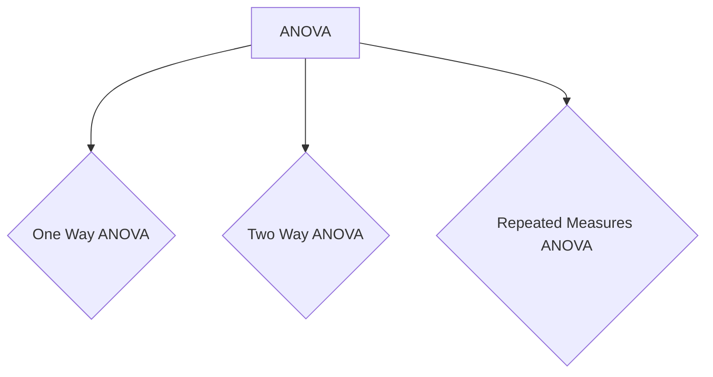
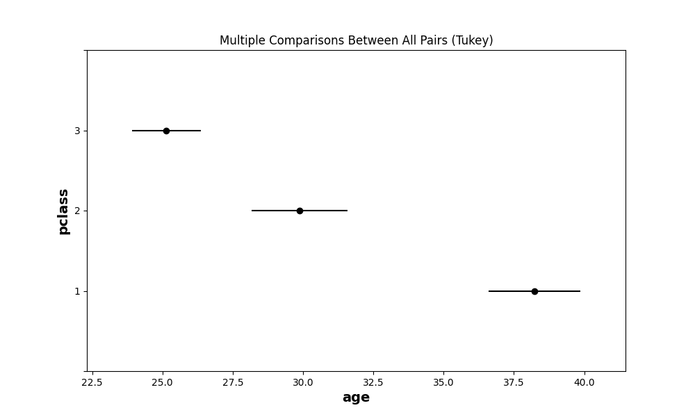
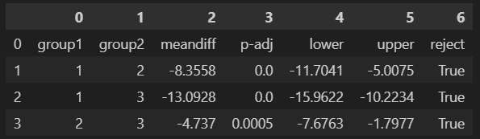

# **Understanding One Way ANOVA**

In the realm of statistical analysis, ANOVA (Analysis of Variance) is a powerful tool that allows researchers to uncover significant differences between multiple groups or treatments. Whether you're conducting a scientific study, analyzing market research data, or simply curious about statistical methodologies, understanding ANOVA can provide valuable insights into the relationships and patterns within your data.

### What is ANOVA?
ANOVA is a statistical technique that compares the means of two or more groups to determine if there are any significant differences among them. It assesses the variability within and between the groups to draw meaningful conclusions about the factors influencing the observed differences. ANOVA is particularly useful when you want to test the null hypothesis that there are no significant differences between the groups.

### Types of ANOVA
There are various types of ANOVA, each suited for different scenarios. The most common types include **one-way ANOVA**, **two-way ANOVA**, and **repeated measures ANOVA**. One-way ANOVA analyzes the effects of a single factor, while two-way ANOVA examines the influence of two factors simultaneously. Repeated measures ANOVA is used when data is collected from the same subjects over multiple time points or conditions.



### [F-Distribution](https://en.wikipedia.org/wiki/F-distribution)

Before starting the ANOVA, we have to learn F-Distribution because this statistical tests are based on the F - Distribution. The F distribution is a probability distribution that arises in the context of statistical inference, particularly in analysis of variance (ANOVA) and regression analysis. It is named after the statistician Sir Ronald Fisher, who developed many fundamental concepts in statistics.


This is a continuous probability distribution by using the Chi-Square Distribution $(χ^2)$ and every Chi-Square distribution has one one parameter - degrees of freedom ($df$).

Lets assume, we have 2 Chi - Square Distribution $(χ^2_1)$ & $(χ^2_2)$ and their degrees of freedoms are $df_1$ and $df_2$ respectively. Then

$$F-Distribution = \frac{χ^2_1/df_1}{χ^2_2/df_2}$$

Because of the Chi-Square distribution takes only non-negative values, the F distribution doesn't have non-negative values. It is positively skewed and has different shapes depending on the degrees of freedom associated with it. This is commonly used to test hypothesis about the equality of two variances in different samples or populations. The F distribution is widely used in various fields of research, including psychology, education, economics and the natural and social sciences, for hypothesis testing and model comparison.

The **F-statistics** is calculated by dividing the ratio of two sample variances or mean squares from an ANOVA table. This value is then compared to critical values from the F-distribution to determine statistical significance.

### One Way ANOVA

One-way ANOVA (Analysis of Variance) is a statistical technique that allows researchers to compare the means of three or more groups to determine if there are any significant differences among them. This powerful tool is widely used in various fields, from social sciences and psychology to business and healthcare. Understanding the basics of one-way ANOVA can help unravel hidden patterns and group distinctions within your data.

One-way ANOVA is a parametric statistical test that examines the variability between multiple groups based on a single independent variable, also known as a factor. The goal is to determine if the observed differences in means across groups are statistically significant or simply due to chance. This type of ANOVA is particularly useful when you want to compare more than two groups simultaneously.

### Working principle of One-way ANOVA

One-way ANOVA works by decomposing the total variability in the data into two components: the variability between groups and the variability within groups. It then calculates an F-statistic by comparing the ratio of between-group variability to within-group variability. The F-statistic follows an F distribution, which is used to assess the statistical significance of the group differences.

### Steps to calculate One Way ANOVA

1. Define the null ($H_0$) and alternative hypothesis ($H_1$). The null hypothesis is that all the group means are equal. The $H_1$ is that at least one group is significantly different from others.
2. Calculate the overall mean (grand mean) of all the groups combined and mean of all the groups individually.
3. Calculate the "between-group" and "within-group" sum of squares (SS) and their respective degrees of freedom.
4. Calculate the "between-group" and "within-group" mean squares (MS) by dividing their respective sum of the squares by their degrees of freedom.
5. Calculate the F-Statistics by dividing the "between-group" mean square by the "within-group" mean square.
6. By using the F-Statistics, calculate the P-Value.
7. By comparing the P-value with your threshold ($\alpha$), either accept or reject the Null Hypothesis.

This calculation can be represented by **The ANOVA Table**

| Source of variance | Sums of Squares | Degrees of freedom | Mean square | F-Statistics | P-value |
| :--: | :--: | :--: | :--: | :--: | :--: |
| **Between groups** | $SS_{b}$ | k-1 | $MS_{b}$ | $MS_b/MS_w$ | p |
| **Within groups** | $SS_{w}$ | N-k | $MS_{w}$ | - | - |
| **Total** | $SS_{t}$ | N-1 | - | - | - |

### Hands on Example

Let's see we have a dataset like the below one. We have 3 groups (A, B and C) and for each group has different numerical values.

<center>

| A | B | C |
| :--: | :--: | :--: |
| 3 | 1 | 8 |
| 6 | 8 | 6 |
| 3 | 9 | 10 |

</center>

You can assume the "Pclass" and "Age" column from the famous titanic dataset. The "Pclass" has 3 categories e.g., class-1, class-2 and class-3 and the numericals are the "Age" column values. The "Pclass" is called **factors** and categories/groups are called **levels**. For every level can have different number of values. For each value of the levels are called **individuals.**


- **Step-1:** Define the $H_0$ hypothesis.

$$H_0 = \mu_A =\mu_B = \mu_C$$

Define the $H_1$. $H_1 =$ At-least one mean is significantly different.

- **Step-2:** Now, for every group we have to find the mean. So,

$$\overline{X_A} = 4; \ \overline{X_B} = 6; \ \overline{X_C} = 8$$

And the grand mean is

$$\overline{X} = \frac{\overline{X_A} + \overline{X_B} + \overline{X_C}}{3} = 6$$

- **Step-3:** Now time to calculate the SS (Sum of Squares).

$$\large SS_{total} = \sum_{j=1}^{levels}\sum_{i=1}^{individuals}(\overline{X_{ij}} - \overline{X})^2 = 76$$

and the degrees of freedom is

$$\large df_{total} = N - 1 = 9 - 1 = 8$$

where, $N$ is the total individuals.
 
Now we will calculate the **Sum of Squares Between**.

$$ \large SS_{between} = \sum_{j=1}^{levels}(\overline{X_j} - \overline{X})^2*n_j = 24 $$.

$$ \large df_{between} = k - 1 = 3 - 1 = 2 $$

Where $k$ is the number of levels.

We can also calculate the **Sum of Squares Within**.

$$ \large SS_{within} =  \sum_{j=1}^{levels}\sum_{i=1}^{individuals}(X_{ij} - \overline{X_j})^2 = 52 $$

$$ \large df_{within} = N - k = 9 - 3 = 6 $$

You can notice that

$$ \large SS_{total} = SS_{between} + SS_{within} $$

$$ \large df_{total} = df_{between} + SS_{within} $$

- **Step-4:** Now time to calculate the Mean of Squares from the Sum of Squares.

$$ \large MS_{between} = \frac{SS_{between}}{df_{between}} = \frac{24}{2} = 12 $$

$$ \large MS_{within} = \frac{SS_{within}}{df_{within}} = \frac{52}{6} = 8.67 $$

- **Step-5:** Now time to calculate the F-Statistics.

$$ \large F_{k-1, N-k} = \frac{MS_{between}}{MS_{within}} = \frac{12}{8.67} = 1.384 $$

- **Step-6:** By using the F-Statistics value, we will calculate the P-Value. For that you can use the below python code.

```python
import scipy.stats as stats

f_statistic = 1.384  # The F-statistic value you've calculated
df1 = 2              # Degrees of freedom for the numerator (between groups)
df2 = 6              # Degrees of freedom for the denominator (within groups)

p_value = stats.f.sf(f_statistic, df1, df2)
print("P-value:", p_value)
```
And the value is calculated **0.320**.

- **Step-7:** The P-value is much greater than the significant value ($\alpha = 0.05$). So, we can't find enough evidence to reject the null hypothesis. That's why we can say that the groups/levels are taken from the same population.

### Assumptions of One Way ANOVA

1. **Independence:** The observations within and between groups should be independent of each other. This means that the outcome of one observation should not influence the outcome of another. Independence is typically achieved through random sampling or random assignment of subjects to groups.

2. **Normality:** The data within each group should be approximately normally distributed. While one-way ANOVA is considered to be robust to moderate violations of normality, severe deviations may affect the accuracy of the test results. If normality is in doubt, non-parametric alternatives like the **Shapiro-Wilk test** can be considered.

3. **Homogeneity of variances:** The variances of the populations from which the samples are drawn should be equal, or at-least approximately so. This assumption is known as *homoscedasticity*. If the variances are substantially different, the accuracy of the test results may be compromised. **Levene's test** or **Bartlett's test** can be used to assess the homogeneity of variance. If this assumption is violated, alternative tests such as **Welch's ANOVA** can be used.

### Practical example with code

```python
# import the necessary libraries
import seaborn as sns
import pingouin as pg  # pip install pingouin

# load the famous titanic dataset
df = sns.load_dataset('titanic')

# calculate the ANOVA table
anova_table = pg.anova(data=df, dv='age', between='pclass', detailed=True)

print(anova_table)
```

The result of the above is like this:

| Source | SS | DF | MS | F | p-unc | np2 |
| :--: | :--: | :--: | :--: | :--: | :--: | :--: |
| pclass | 20929.627754 | 2 | 10464.813877 | 57.443484 | 7.487984e-24 | 0.139107 |
| Within | 129527.008190 | 711 | 182.175820 | NaN | NaN | NaN |

The **p-unc** is the P-value of this ANOVA test. You can see that the P-value is very less compared to the significant level ($\alpha = 0.05$). So we can get enough evidence to reject the Null Hypothesis ($H_0$). That's mean atleast one of the category of the *pclass* is significantly different from the others. But **the ANOVA test can't tell which group(s) is/are significantly different from others.** To know which group(s) is/are significantly different, we have to do **Post-Hoc test**. 

### Post-Hoc Test

While ANOVA determines if there are significant differences between groups, it does not reveal the specific pairings of groups that differ. Post hoc tests address this limitation by allowing researchers to make multiple pairwise comparisons. These tests provide a more detailed understanding of the group differences, enabling researchers to draw more precise conclusions. Generally, it has two types:

1. Bonferroni correction
2. Tukey's HSD (Honestly Significant Differece) Test

#### Bonferroni correction

In this test, perform all the possible t-test and then compare the result. Or, you can do few number of tests and compare them. This method adjusts the significance level ($\alpha$) by dividing it by the number of comparisons being made. It is a conservation The Bonferroni correction is a conservative approach that adjusts the significance level for each comparison to maintain the overall family-wise error rate. This method divides the desired alpha level by the number of pairwise comparisons. While effective in controlling Type I error, the Bonferroni correction may be overly stringent and increase the chance of Type II error.

```python
import scipy.stats as stats

for class1, class2 in [(1,2), (2, 3), (3, 1)]:
    print(f"Class {class1} vs Class {class2}")
    print(stats.ttest_ind(df[df['pclass'] == class1]['age'].dropna(),
                          df[df['pclass'] == class2]['age'].dropna()))
    print()
```

And the result is like this

```bash
Class 1 vs Class 2
Ttest_indResult(statistic=5.485187676773201, pvalue=7.835568991415144e-08)

Class 2 vs Class 3
Ttest_indResult(statistic=3.927800191020872, pvalue=9.715078600777852e-05)

Class 3 vs Class 1
Ttest_indResult(statistic=-10.849122601201033, pvalue=6.134470007830625e-25)
```

If we see the result, then the Class 1 vs Class 2 test and Class 3 vs Clas 1 test results are extremly significant. So, the Class 1 of "pclass" is significantly different from the others. But if we take significant level $\alpha = \frac{0.05}{3} = 0.0167$ then all the groups are significantly different from each other.

#### Tukey's HSD Test

Tukey's HSD test is widely used and provides simultaneous confidence intervals for all possible pairwise comparisons. It controls the family-wise error rate, making it a popular choice. Tukey's HSD test is suitable for equal and unequal sample sizes.

```python
# import the required libraries
from statsmodels.stats.multicomp import pairwise_tukeyhsd
import matplotlib.pyplot as plt
import pandas as pd

# select our columns and drop the NaN values
required_df = df[['age', 'pclass']].dropna()
tukey = pairwise_tukeyhsd(endog=required_df['age'], groups=required_df['pclass'], alpha=0.05)

tukey.plot_simultaneous()

plt.show()
```

The result of the above code is



You can also see the summary of this test by running the below code.

```python
pd.DataFrame(tukey.summary())
```

The result is



### Disadvantages of One Way ANOVA

While one-way ANOVA is a useful statistical technique, it also has certain drawbacks that researchers should be aware of. Here are some common drawbacks of one-way ANOVA:

**Assumption of Homogeneity of Variances:** One-way ANOVA assumes that the variances across all groups are equal. Violation of this assumption, known as heteroscedasticity, can affect the accuracy and validity of the results. It may lead to inflated or deflated Type I error rates, making it challenging to draw accurate conclusions.

**Sensitivity to Outliers:** One-way ANOVA can be sensitive to outliers, particularly when the sample sizes are small. Outliers can significantly impact the mean and variance, potentially influencing the results and leading to incorrect interpretations.

**Assumption of Normality:** One-way ANOVA assumes that the data within each group follows a normal distribution. If the assumption is violated, it can affect the validity of the results. However, one-way ANOVA is often robust to violations of normality, especially when the sample sizes are large.

**Limited to One Independent Variable:** As the name suggests, one-way ANOVA is designed to analyze the effects of a single independent variable or factor on a dependent variable. It is not suitable for investigating the influence of multiple independent variables or complex relationships between variables. In such cases, other statistical techniques like factorial ANOVA or regression analysis may be more appropriate.

**Post-hoc Interpretation:** While one-way ANOVA can identify significant group differences, it does not provide specific information about which groups differ from each other. Post-hoc tests are often necessary to make pairwise comparisons, but these tests increase the chances of Type I errors. Multiple post-hoc tests also require careful consideration of family-wise error rate control methods.

**Lack of Causal Inference:** One-way ANOVA examines associations and differences between groups, but it does not establish causality. It only provides evidence for the existence of group differences, not the underlying causes or mechanisms responsible for those differences. Causal relationships may require additional experimental designs or more sophisticated statistical analyses.

**Sample Size Considerations:** One-way ANOVA performs better with larger sample sizes. Small sample sizes can limit the statistical power of the analysis, making it difficult to detect significant group differences accurately. It is crucial to ensure an adequate sample size to increase the reliability and generalizability of the findings.

### Applications of ANOVA

**Hyperparameter tuning:** When selecting the best hyperparameters for a machine learning model, one-way ANOVA can be used to compare the performance of models with different hyperparameter settings. By treating each hyperparameter settings as a group, you can perform one-way ANOVA to determine if there are any significant differences in performance across the various settings.

**Feature selection:** One-way ANOVA can be used as a univariate feature selection method to idenity features that are significantly associated with the target variable, especially when the target variable is categorical with more than two levels. In this context, the one-way ANOVA is performed for each feature, and features with low p-values are considered to be more relevant for prediction.

**Algorithm comparison:** When comparing the performance of different machine learning algorithms, one-way ANOVA can be used to determine if there are any significant differences in their performance metrics (e.g., accuracy, F1 score, etc.) across multiple runs or cross-validation folds. This can help you decide which algorithm is the most suitable for a specific problem.

**Model stability assessment:** One-way ANOVA can be used to assess the stability of a machine learning model by comparing its performance across different random seeds or initializations. If the model's performance varies significantly between different initializations, it may indicate that the model is unstable or highly sensitive to the choice of initial conditions.

### Why t-test is not used

